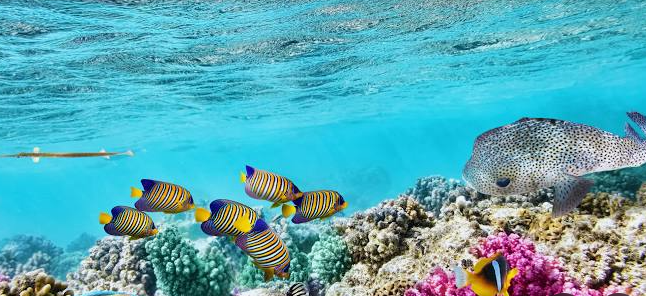

# Barrier Reef Detection

## Description
This project aims to detect and segment coral reefs using computer vision techniques. 
It is inspired by the Kaggle Barrier Reef competition.



## Folder Structure
- `data/`: Contains raw and processed image data.
- `src/`: Python scripts for loading data, training models, and evaluation.
- `notebooks/`: Jupyter notebooks for exploration and experiments.
- `tests/`: Unit tests for the codebase.

## Setup Instructions
1. Clone the repository:
   ```bash
   git clone <repo-url>
   cd your-repo-name
